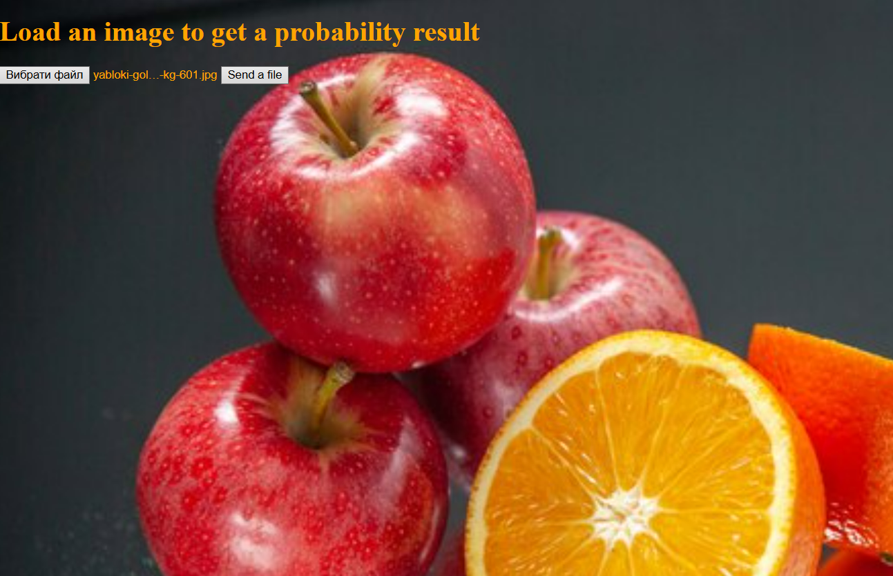
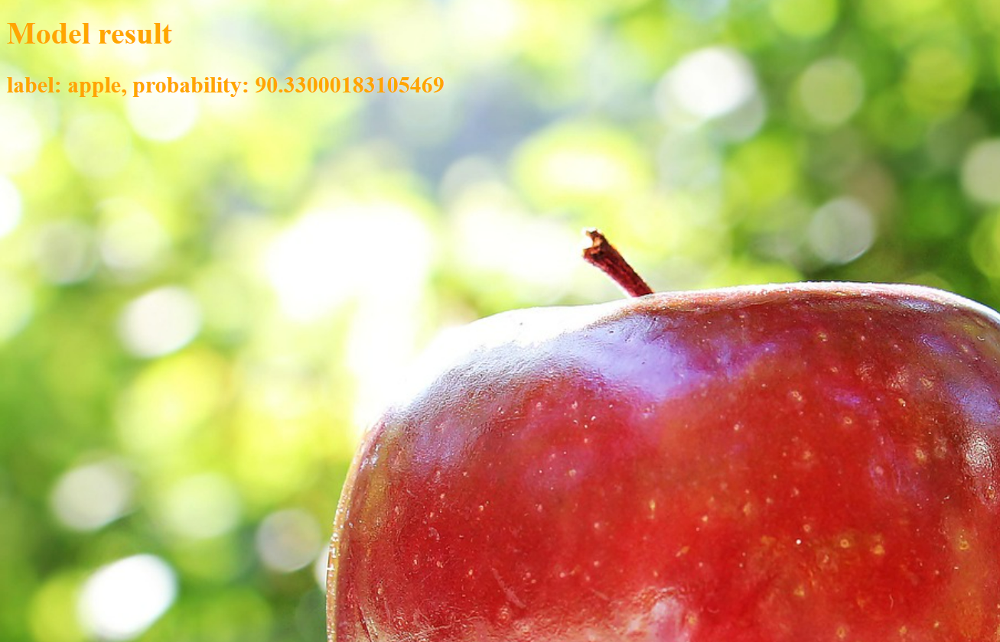
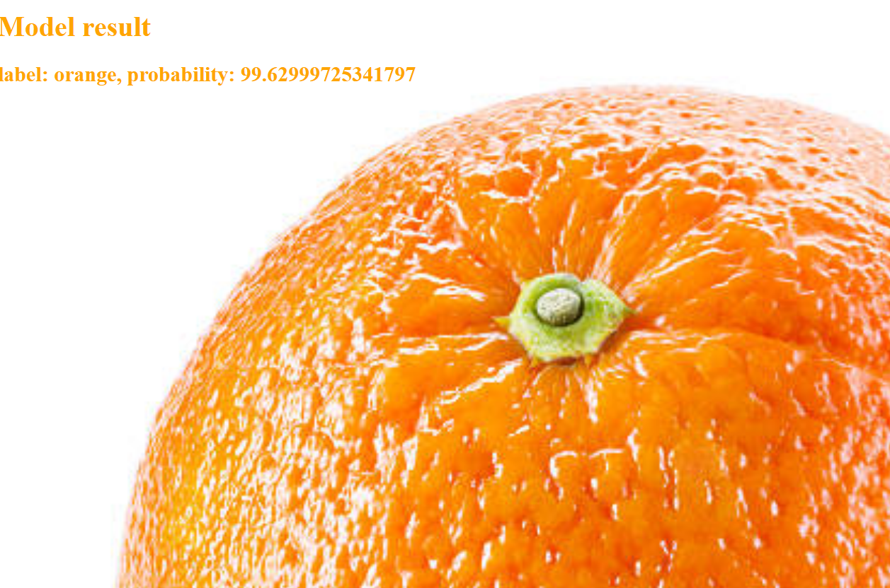

# APPLES_OR_ORANGES_IMAGE_CLASSIFICATION

## Getting Started

Installing venv
```shell
python -m venv venv
venv\Scripts\activate
pip install -r requirements.txt
```

Starting app
```shell
fastapi dev
```

## Usage:
You can classify image apples&oranges


## Features
-Model created by tensorflow.keras on Google Colab
-Frontend Jinja2&FastAPI

## Additional info

Url on Google Colab (model): https://colab.research.google.com/drive/1m7gFjMU67yN3CulwJctlq7DOlWFb8CAg?usp=sharing